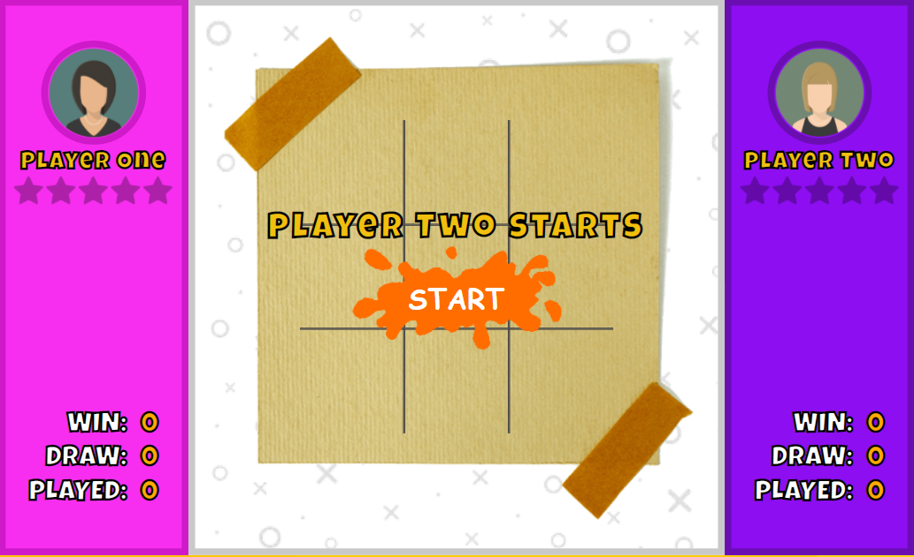
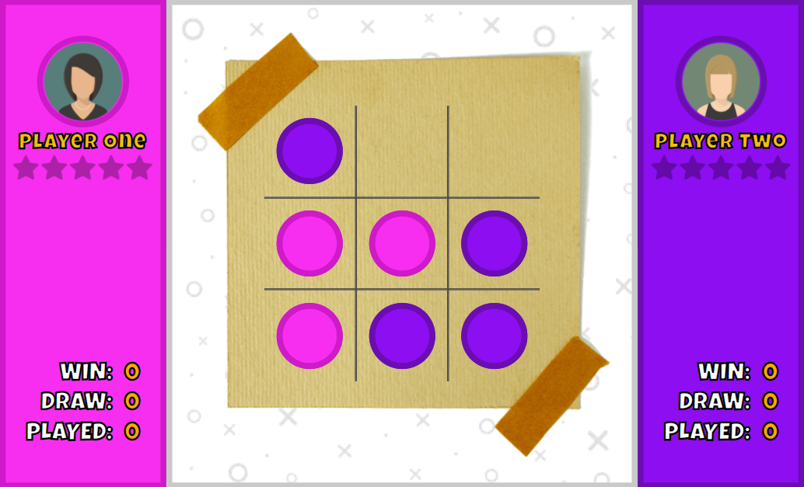
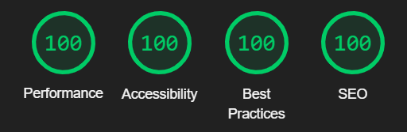

Project Link: [Pinks and Purples](https://bit.ly/pinks-and-purples)

# Pinks and Purples

<!-- A little info about your project and/ or overview that explains **what** the project is about. -->

A two player game of naughts and crosses.

## Game Details

Each player choses ten numbers (from available lotto numbers range). Mark off each of your numbers if the ball was drawn in the official lotto draw. The winner is the first person to match all ten numbers.

## Motivation

<!-- A short description of the motivation behind the creation and maintenance of the project. This should explain **why** the project exists. -->

I first designed the loopy lotto in excel and played it at work with colleagues. Then I started to learn web development so it made sense that I coded it up. It was my first project using Javascript and during the development process I also learnt SASS.
I now play among family and friends.

<!-- ## Build status

Build status of continus integration i.e. travis, appveyor etc. Ex. -

[](https://travis-ci.org/akashnimare/foco)
[](https://ci.appveyor.com/project/akashnimare/foco/branch/master) -->

## Code

Written in vanilla Javascript and SASS

<!-- If you're using any code style like xo, standard etc. That will help others while contributing to your project. Ex. - -->
<!-- [](https://github.com/feross/standard) -->

## Screenshots

<!-- Include logo/demo screenshot etc. -->





<!-- ## Tech/framework used

Ex. -

<b>Built with</b>

- [Electron](https://electron.atom.io) -->

<!-- ## Features

What makes your project stand out? -->

## Features

- Local Storage
- SCSS Variables
- CSS Grid
- ES6 Modules

<!-- ## Code Example

Show what the library does as concisely as possible, developers should be able to figure out **how** your project solves their problem by looking at the code example. Make sure the API you are showing off is obvious, and that your code is short and concise. -->

<!-- ## Installation

Provide step by step series of examples and explanations about how to get a development env running. -->

<!-- ## API Reference

Depending on the size of the project, if it is small and simple enough the reference docs can be added to the README. For medium size to larger projects it is important to at least provide a link to where the API reference docs live.

## Tests

Describe and show how to run the tests with code examples. -->

## How to use?

<!-- If people like your project they’ll want to learn how they can use it. To do so include step by step guide to use your project. -->
<!--
1.Player data is added in users.json
2.Every draw is added in draws.json

```javascript
	{
			"date": "19/02/2022",
			"day": "Saturday",
			"numbers": [33,34,44,50,56,57],
			"bonusBall": 26,
			"winner": false
		}
```

3.Countdown timer is reset in var nextDraw located in countdownTimer function

```javascript
const nextDraw = 'Feb 23, 2022 19:45:00';
```

4.Winner is added in draw object

```javascript
	{
			"date": "19/02/2022",
			"day": "Saturday",
			"numbers": [33,34,44,50,56,57],
			"bonusBall": 26,
			"winner": "WINNERS NAME"
		}
```

5.To begin a new game, add start date in startDateInput.mjs

```javascript
const gameStartDates = [
	'08/08/2020',
	'30/09/2020',
	'26/12/2020',
	'10/02/2021',
	'24/03/2021',
	'12/05/2021',
	'10/07/2021',
	'11/08/2021',
	'09/10/2021',
	'13/11/2021',
	'18/12/2021',
	'02/02/2022',
];
``` -->

<!-- ## Contribute

Let people know how they can contribute into your project. A [contributing guideline](https://github.com/zulip/zulip-electron/blob/master/CONTRIBUTING.md) will be a big plus. -->

<!-- ## Credits

Give proper credits. This could be a link to any repo which inspired you to build this project, any blogposts or links to people who contrbuted in this project.

#### Anything else that seems useful -->

## Contact

If you want to contact me you can reach me at [daveperry.tech](https://daveperry.tech)

<!-- [loopy lotto repo](https://github.com/your_username/repo_name) -->

## License

<!-- A short snippet describing the license (MIT, Apache etc) -->

Distributed under the MIT License. See [LICENCE.txt](LICENSE.txt) for more information.

<!-- MIT © [Dave Perry]() -->
